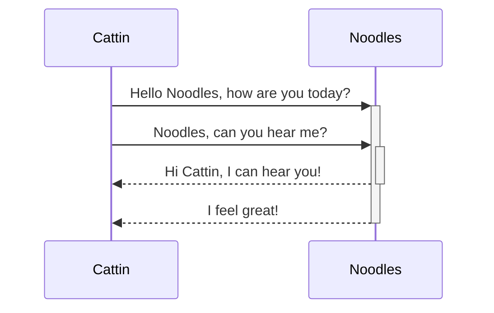
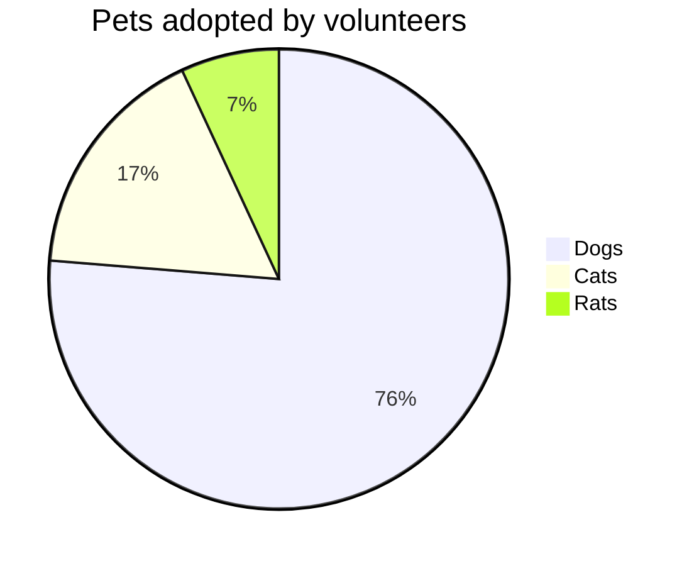

{: .no_toc }
<details close markdown="block">
  <summary>
    Table of contents
  </summary>
  {: .text-delta }
1. TOC
{:toc}
</details>

## Mermaid JS

Mermaid JS provides so codable diagrams that can be rendered in markdown and most modern browsers. Full guide can be found on <https://mermaid-js.github.io/>

Jekyll integration needed using one of these options:

- <https://github.com/jasonbellamy/jekyll-mermaid>
- <https://github.com/jeffreytse/jekyll-spaceship>





@startmermaid
pie title Pets adopted by volunteers
  "Dogs" : 386
  "Cats" : 85
  "Rats" : 35
@endmermaid

### Markdown Guide

Text can be **bold**, _italic_, or ~~strikethrough~~.

[Link to another page](./another-page.html).

There should be whitespace between paragraphs.

There should be whitespace between paragraphs. We recommend including a README, or a file with information about your project.


## Header 1

This is a normal paragraph following a header. GitHub is a code hosting platform for version control and collaboration. It lets you and others work together on projects from anywhere.

### Header 2

> This is a blockquote following a header.
>
> When something is important enough, you do it even if the odds are not in your favor.

#### Header 3

```js
// Javascript code with syntax highlighting.
var fun = function lang(l) {
  dateformat.i18n = require('./lang/' + l)
  return true;
}
```

```ruby
# Ruby code with syntax highlighting
GitHubPages::Dependencies.gems.each do |gem, version|
  s.add_dependency(gem, "= #{version}")
end
```

##### Header 4

* This is an unordered list following a header.
* This is an unordered list following a header.
* This is an unordered list following a header.

###### Header 5

1. This is an ordered list following a header.
2. This is an ordered list following a header.
3. This is an ordered list following a header.

###### A Table

| head1        | head two          | three |
|:-------------|:------------------|:------|
| ok           | good swedish fish | nice  |
| out of stock | good and plenty   | nice  |
| ok           | good `oreos`      | hmm   |
| ok           | good `zoute` drop | yumm  |

### There's a horizontal rule below this

* * *

### Here is an unordered list

* Item foo
* Item bar
* Item baz
* Item zip

### And an ordered list

1. Item one
1. Item two
1. Item three
1. Item four

### And a nested list

* level 1 item
  * level 2 item
  * level 2 item
    * level 3 item
    * level 3 item
* level 1 item
  * level 2 item
  * level 2 item
  * level 2 item
* level 1 item
  * level 2 item
  * level 2 item
* level 1 item

### Small image


### Large image


### Definition lists can be used with HTML syntax

```html
<dl>
<dt>Name</dt>
<dd>Godzilla</dd>
<dt>Born</dt>
<dd>1952</dd>
<dt>Birthplace</dt>
<dd>Japan</dd>
<dt>Color</dt>
<dd>Green</dd>
</dl>
```

```txt
Long, single-line code blocks should not wrap. They should horizontally scroll if they are too long. This line should be long enough to demonstrate this.
```

```txt
The final element.
```
